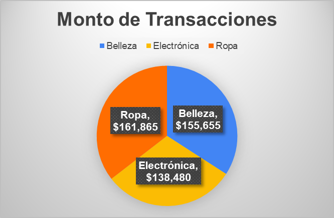

## _Diplomado de Analitica y Ciencia de Datos [Caso Práctico EXCEL]_

Repositorio para controlar los archivos generados durante el diplomado

## Excel
Análisis de datos de una base de datos de venta, segmentado por categorías de productos adquiridos, género de la clientela, catnidad de ventas y monto de las ventas.

### Conclusión

De lo cual se puede observar que:
- La distribución de transacciones por catergoria estan distribuidas en aproximadamente 1/3, considerando o no el género del cliente.
- El género femenino entre las edades de 18 y 64, compró almenos una vez las categorías de Electrónica y Ropa.
- El género masculino entre las edades de 18 y 64, compró almenos una vez la categoría de Ropa.
